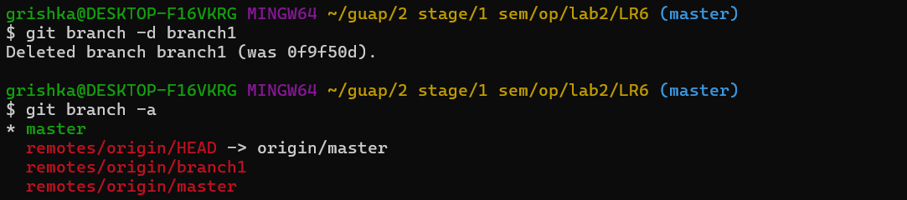

# Лабораторная работа №6: Система контроля версий

## Цель лабораторной работы: изучение базовых возможностей системы управления версиями, опыт работы с Git Api, опыт работы с локальным и удаленным репозиторием.

## Ход работы

### Задание 1 - 6

Сначала был клонирован форк данного репозитория на компьютер. После клонирования репозитория в него был добавлен файл через интерфейс GitHub, затем файл был запулен в локальный репозиторий.

Логи команд:

* git clone https://github.com/zxcgrishka/LR6/tree/master
* git pull

### Задание 7

Получена история операций для каждой из веток.

* git log master
* git checkout -b branch1 origin/branch1
* git log branch1

### Задание 8

Просмотрены последние изменения.

* git log --oneline -5
* git show HEAD

### Задание 9

Выполнено слияние в ветку master. Возникший конфликт, связанный с файлом mergefile.txt был разрешён.

* git merge branch1
* git status
* cat mergefile.txt
* notepad mergefile.txt
* git commit -m ""

### Задание 10

Была удалена побочная ветка после успешного слияния. Сначала она была удалена локально (так как была создана локальная копия ветки), затем на GitHub.
* git branch -d branch1
* git brancg -a

### Задание 11
Был 2 раза изменён файл "newFile.txt", а также создан файл "change.txt", все изменения были закоммичены.
* git status
* git add
* git commit -m ""

### Задание 12
Был выполнен откат последнего коммита
* git reset HEAD~1
* git log

### Задание 13 - 14
Была создана новая ветка для отчёта. Затем начал оформляться сам отчёт с логами команд и скриншотами.
* git checkout -b repBranch

### Задание 15
Была получена история операций в форматированном виде.
* git log --pretty=format:"%h - %ad - %an - %s" --date=short --all

