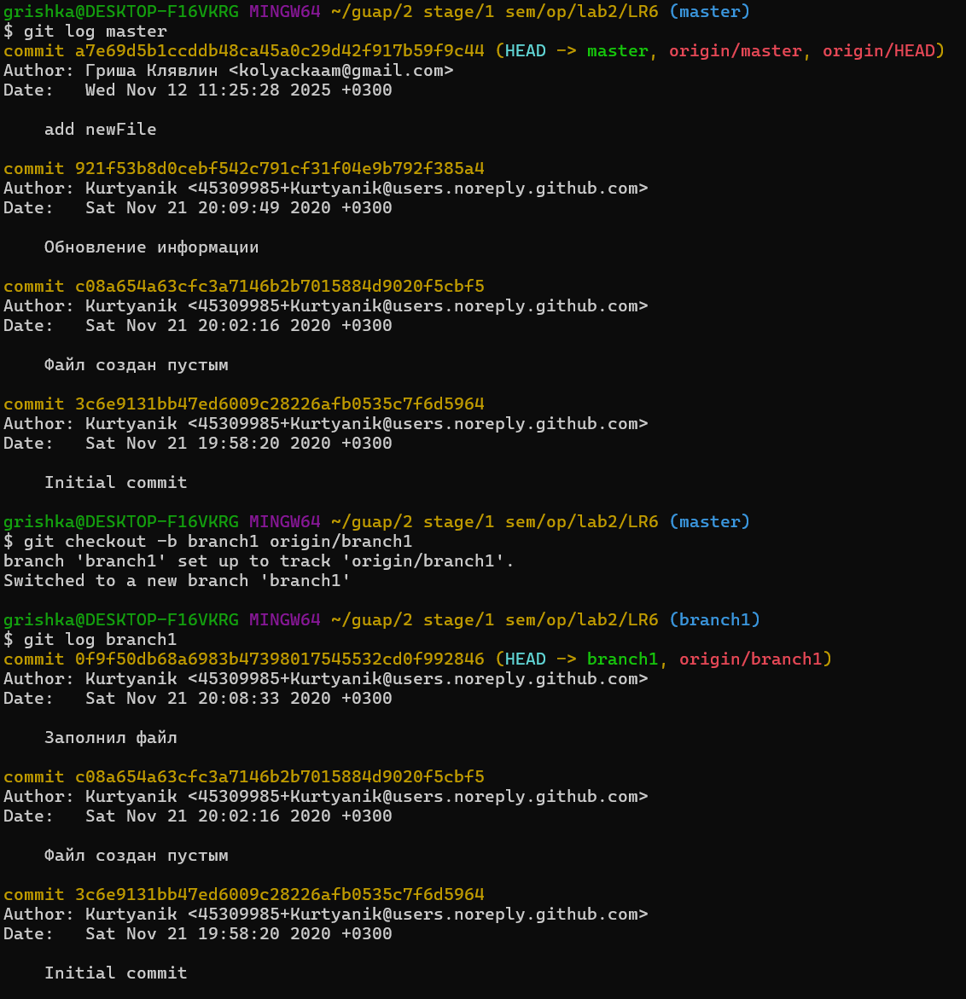
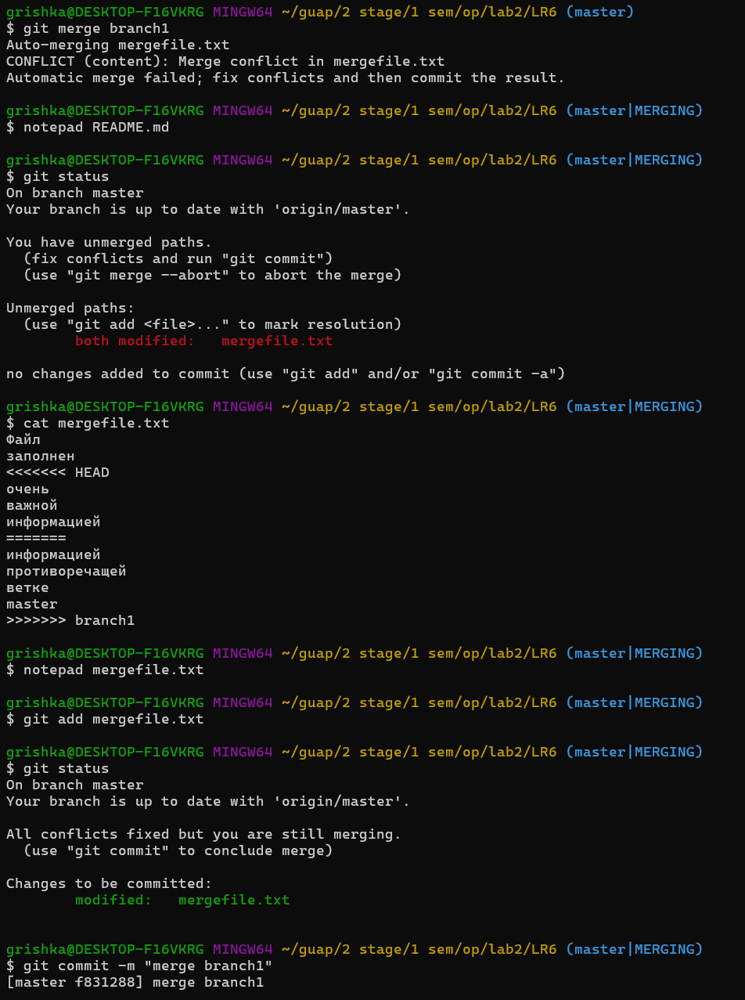

# Лабораторная работа №6: Система контроля версий

## Цель лабораторной работы: изучение базовых возможностей системы управления версиями, опыт работы с Git Api, опыт работы с локальным и удаленным репозиторием.

## Ход работы

### Задание 1 - 6

Сначала был клонирован форк данного репозитория на компьютер. После клонирования репозитория в него был добавлен файл через интерфейс GitHub, затем файл был запулен в локальный репозиторий.

Логи команд:

* git clone https://github.com/zxcgrishka/LR6/tree/master
* git pull

### Задание 7

Получена история операций для каждой из веток.

* git log master
* git checkout -b branch1 origin/branch1
* git log branch1

### Задание 8

Просмотрены последние изменения.

* git log --oneline -5
* git show HEAD

### Задание 9

Выполнено слияние в ветку master. Возникший конфликт, связанный с файлом mergefile.txt был разрешён.

* git merge branch1
* git status
* cat mergefile.txt
* notepad mergefile.txt
* git commit -m ""

